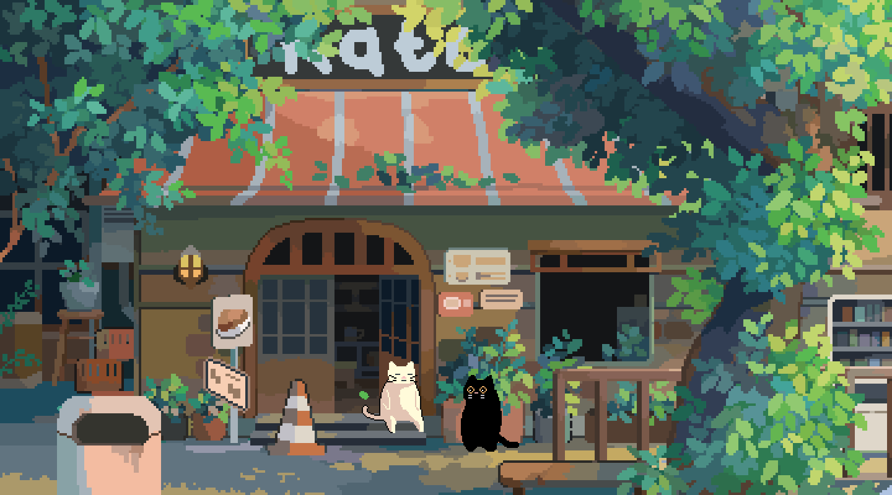

<!-- Header Wave (Commented Out)

  
   

-->

<!-- Footer Wave (Commented Out)

  

-->

<!-- MasterHead -->

<!-- Greeting -->
<!--<h2 align="center">I am Joshua Thadi</h2>-->

  <!-- Profile Views -->
  
  
  
  <!---->

  <!-- Total Stars -->
  

  <!-- Followers -->
  

  
  

<!-- About Me -->
<h3 align="left">About Me</h3>
 

  I'm a third-year <strong>Data Science & AI Engineering</strong> student with hands-on experience building end-to-end ML & DL pipelines. My work spans the entire AI lifecycle—from data collection and preprocessing, to model training, evaluation, and explainability.

  I'm comfortable working across the full AI engineering stack, including backend APIs, databases, and modern LLM-based systems. As a strong communicator, I thrive in collaborative environments and am actively seeking opportunities to contribute to impactful, real-world AI projects.

  
  
  
  

 
 

<!-- Languages & Tools -->
<h3 align="center">Languages & Tools I Have Placed My Hands On</h3>
 

   
   
   
   

 
 

<!-- GitHub Status -->
<h3 align="center">Statistics</h3>
 

  
  
    
  
    
  

<!-- Best Repositories -->

  <h3>Interesting Repositories</h3>
   
  

  

<!-- Tech Stack -->
<h3 align="center">Tech Stack</h3>
 

<!-- Languages -->

<!-- Support -->
<!-- <h3 align="center">Support Me</h3>

  

 -->

<!-- Ending -->

  This README is uniquely designed by <strong>@chanreach-ouch.</strong>

